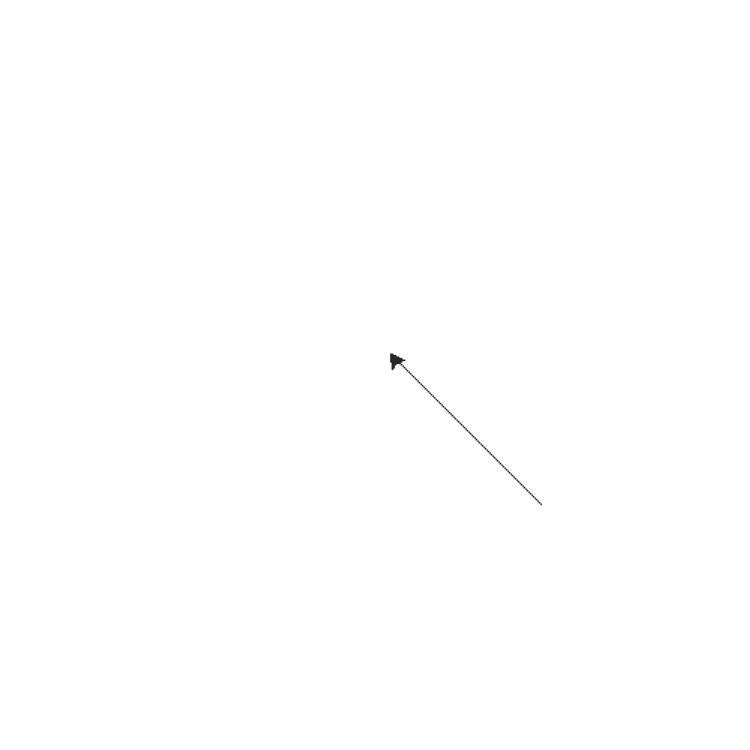
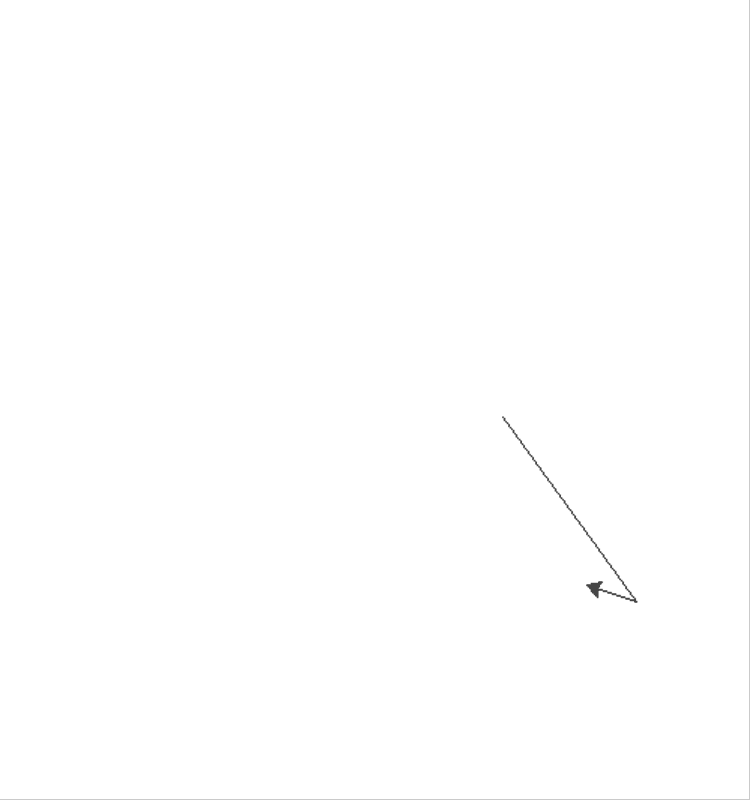

## 题解说明

1-5题略，对第6题编写的函数进行部分说明

#### 第6题 使用turtle绘图

本题中编写了两个辅助函数分别为*draw_ploygon*和*draw_angle*

- draw_ploygan(n, distance): 用于绘制正n边形，参数n表示边数，distance表示顶点到中心距离
- draw_angle(n, distance): 用于绘制正n角形，参数n表示角数，distance表示顶点到中心距离

选绘的图形及对应函数如下：

- draw_shape1

  

- draw_shape2

  

- draw_shape3

  

- draw_shape4

  