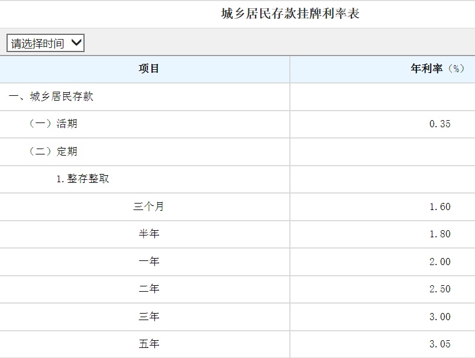

1. 如果你有9万元钱，请计算整存整取5年期和1年期（每年存1次，存5次）两种方式5年后各自总额是多少？存5年期多收入多少钱？

   

2. 

3. 2020 年末，中国大陆总人口（包括31个省、自治区、直辖市和中国人民解放军现役军人，不包括香港、澳门特别行政区和台湾省以及海外华侨人数）**141178**万人，人口出生率为8.52‰，人口死亡率为7.07‰*（数据来源于**[国家数据][1]**）*

   假如2021年趋势不变，请计算2021年每秒出生多少人，死亡多少人。

4. 北京2015年机动车保有量限575万辆，一辆汽车平均每千米排放150克废气,一年平均每辆汽车行驶15000千米。请计算北京2015年全年机动车排放废气多少吨。

   北京市常驻人口2114万人，平均每人吸入多少废气？

5. 在网上查资料，编写一个程序计算中国每年消耗多少原油？中国原油储备有多少？生产多少？需要进口多少原油？如果发生战争，中国的原油储备和自产原油可以维持多少天？

   > 2018年中国原油消费总量63004.3万吨，产量18932.4万吨，进口量46188.5万吨
   >
   > 2019年中国原油储量35.5亿吨
   >
   > *数据来源于**[国家数据][1]***

6. turtle绘制图形

[1]: https://data.stats.gov.cn/easyquery.htm?cn=C01	"国家数据"